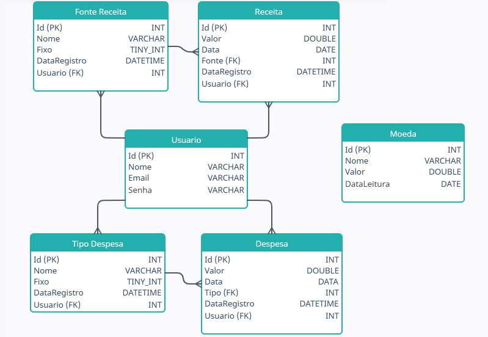
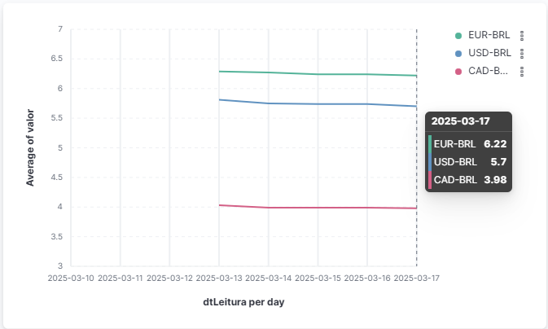
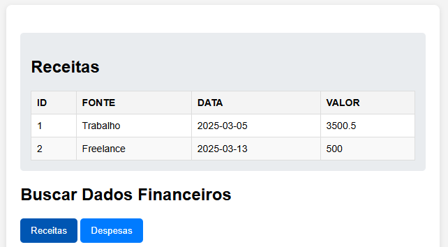
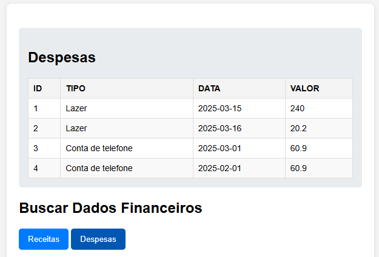
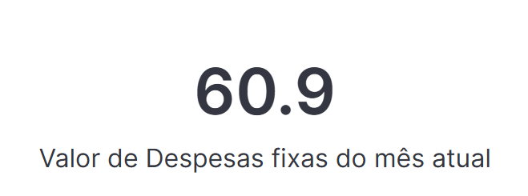
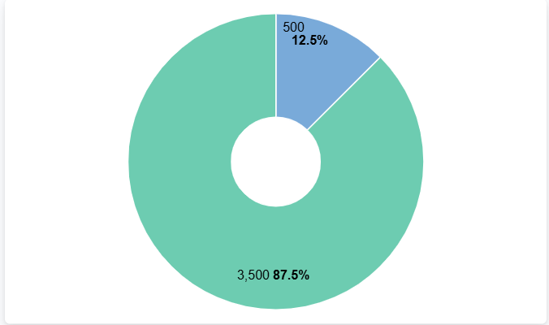
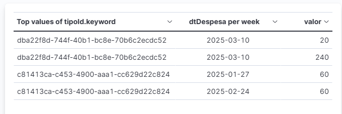
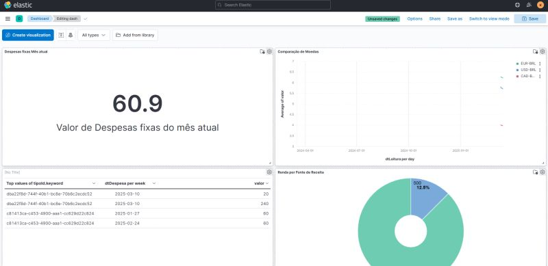

#  Finance-API

  

Esta é uma API que trata dados fincanceiros para insights de uso pessoal.

Você pode se cadastrar, onde cada usuário cadastrado conseguirá registrar suas rendas e despesas.

#  Tecnologias utilizadas
 - Python
 - Flask
 - Kibana
 - ElasticSearch
 - Docker
 - AwesomeAPI
 - Html/Js/Css (Interface para fazer as requisições)

# Ideação
A ideia principal do projeto era desenvolver uma API Rest Python com Flask, usando ElasticSearch para armazenamento de dados, e eventuamente utilizando a Kibana como interface para visualização de dados.
A API tem um shedule para armazenar dados de cotação diariamente de BRL, USD, CAD, EUR consumindo de [awesomeApi](https://economia.awesomeapi.com.br)

# Diagrama de Entidade Relacionamento

# Visualização de Dados
## Comparação de Moedas (Kibana)
- 
## Listagem de Receitas de usuário (index)
- 
## Listagem de Despesas de usuário (index)
- 
## KPI de Despesas fixas (Kibana)
- 
## Renda por Fonte de Receita (Kibana)
- 
## Listagem de receita em tabela (Kibana)
- 

## Dashboard (Kibana)
- 

# Requisições
### **Requisição POST para criar um usuário**

-   **Rota**: `/users`
-   **Método**: `POST`
-   **Descrição**: Cria um novo usuário com os dados fornecidos (`nome`, `email`, `senha`).

    - `{"nome": "João Silva", "email": "joao.silva@example.com", "senha": "senha123"}`
    
   - **Resposta**
	    - `{"message": "Usuário criado com sucesso!", "user_id": "UUID"}``

### **Requisição POST para fazer login**

-   **Rota**: `/login`
-   **Método**: `POST`
-   **Descrição**: Autentica o usuário com o e-mail e senha fornecidos
    - `{ "email": "joao.silva@example.com", "senha": "senha123"}`
   - **Resposta**
        - `{ "auth": "token_jwt_aqui", "message": "Login bem sucedido!"}`
    
### **Requisição POST para criar uma fonte de receita**

-   **Rota**: `/receitas/fontes`
-   **Método**: `POST`
-   **Autenticação**: Requer token JWT via `@jwt_required()`.
-   **Descrição**: Cria uma nova fonte de receita associada ao usuário autenticado.
-   **Exemplo de corpo da requisição**:
	   - `{  "nome":  "Salário",  "fixo":  true  }` 
-   **Resposta**:
	   -  `{  "_id":  "UUID",  "user":  "user_id",  "nome":  "Salário",  "fixo":  true,  "dtRegistro":  "2025-03-17T10:00:00"  }` 

### **Requisição GET para listar fontes de receita**

-   **Rota**: `/receitas/fontes`
-   **Método**: `GET`
-   **Autenticação**: Requer token JWT via `@jwt_required()`.
-   **Descrição**: Lista todas as fontes de receita associadas ao usuário autenticado.
-   **Resposta**:
    -    `[  {  "_id":  "UUID",  "user":  "user_id",  "nome":  "Salário",  "fixo":  true,  "dtRegistro":  "2025-03-17T10:00:00"  }  ]` 

###  **Requisição POST para criar uma despesa**

-   **Rota**: `/despesas`
-   **Método**: `POST`
-   **Autenticação**: Requer token JWT via `@jwt_required()`.
-   **Descrição**: Cria uma nova despesa associada ao usuário autenticado.
-   **Exemplo de corpo da requisição**:
	   - `{  "valor":  150.75,  "tipoId":  "UUID",  "dtDespesa":  "2025-03-17"  }` 
-   **Resposta**:
    - `{  "_id":  "UUID",  "user":  "user_id",  "valor":  150.75,  "tipoId":  "UUID",  "dtDespesa":  "2025-03-17",  "dtRegistro":  "2025-03-17T10:00:00"  }` 

### **Requisição GET para listar despesas**

-   **Rota**: `/despesas`
-   **Método**: `GET`
-   **Autenticação**: Requer token JWT via `@jwt_required()`.
-   **Descrição**: Lista todas as despesas associadas ao usuário autenticado.
-   **Resposta**:
    -    `[  {  "_id":  "UUID",  "user":  "user_id",  "valor":  150.75,  "tipoId":  "UUID",  "dtDespesa":  "2025-03-17",  "dtRegistro":  "2025-03-17T10:00:00"  }  ]` 

### **Requisição POST para criar um tipo de despesa**

-   **Rota**: `/despesas/tipos`
-   **Método**: `POST`
-   **Autenticação**: Requer token JWT via `@jwt_required()`.
-   **Descrição**: Cria um novo tipo de despesa.
-   **Exemplo de corpo da requisição**:
	   - `{  "nome":  "Aluguel",  "fixo":  true  }` 
-   **Resposta**:
	- `{  "_id":  "UUID",  "user":  "user_id",  "nome":  "Aluguel",  "fixo":  true,  "dtRegistro":  "2025-03-17T10:00:00"  }` 
    

###  **Requisição GET para listar tipos de despesa**

-   **Rota**: `/despesas/tipos`
-   **Método**: `GET`
-   **Autenticação**: Requer token JWT via `@jwt_required()`.
-   **Descrição**: Lista todos os tipos de despesa associados ao usuário autenticado.
-   **Resposta**:
	- `[  {  "_id":  "UUID",  "user":  "user_id",  "nome":  "Aluguel",  "fixo":  true,  "dtRegistro":  "2025-03-17T10:00:00"  }  ]`

# Referências
[ElasticSearch](https://www.youtube.com/watch?v=1U3Sc4emnsU)